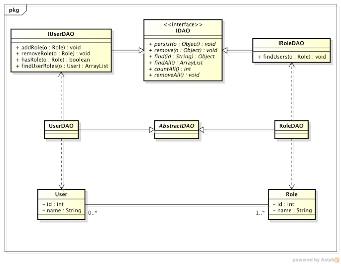

Hibernate - Annotation
===================

Projeto em Java, com Hibernate, usando Annotation

Programação V

Bacharel em Sistemas de Informação - 5ª Fase

<!--<h3>Modelo UML</h3>
-->

Projeto com Query Nomeada <a href="https://github.com/FabricioRonchi/HibernateQuery" target="blank">aqui</a>.
